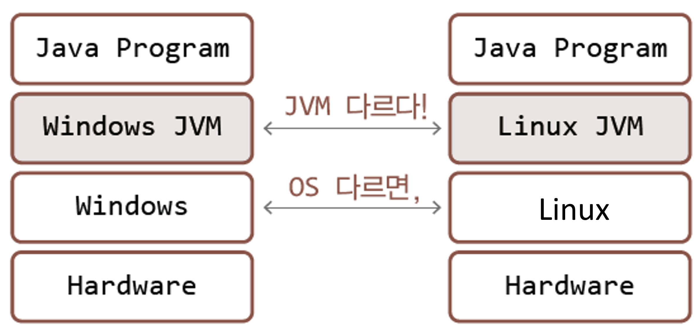

# Java Chapter 01

### 자바 프로그램과 실행의 원리에 대한 이해

- `JAVA.EXE` : 자바 런처로써 JVM을 실행시키고 우리가 만든 자바프로그램을 올려주는 역할

### 운영체제에 따른 자바 가상머신의 차이

- 프로그램 자체가 운영체제에 의존적이기 때문에 운영체제 별로 **JVM**이 다릅니다.
- 즉 **JVM** 때문에 JAVA는 운영체제가 달라도 동일하게 실행할 수 있습니다.

### 자바 컴파일러와 자바 바이트코드

- 자바 컴파일러(javac.exe)가 JVM이 이해할 수 있는 파일로 바꿔줍니다.
- 소스파일(.java) => 클래스 파일(.class)
  - 바이트코드 : 클래스파일에 존재
