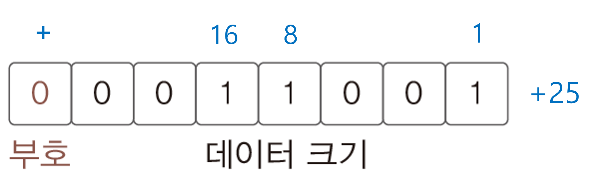

# Java Chapter 02

### 1. 변수의 이해와 활용

- 변수 : 메모리 공간의 할당과 접근을 위해 필요한 도구
  - 변수 선언 => 메모리 공간 할당
  - 용도 + 변수이름

- 기본 자료형


- 변수 이름 제약사항
  - 대소문자를 구분
  - 숫자로 시작 불가
  - `$`과 `_`이외에 특수문자 사용 불가
  - 키워드 사용 불가


### 2. 정수의 표현 방식 이해하기

- 컴퓨터가 양의 정수를 표현하는 방식
  - 부호 비트(가장 왼쪽)가 0이면 양의 정수 / 1이면 음의 정수
  - 나머지 비트는 값의 크기를 결정



- `-25`를 표현할 때 부호비트만 바꾸면 될 까?
  - 그러면 문제 발생 => 변환된 `25`와 `-25`를 덧셈해보면 부호비트 때문에 `0`이 나오지 않습니다.
  - **2의 보수**를 취한 결과를 음의 정수로 표현
    - 2의 보수 방법 : 1의 보수를 취하고 1을 다시 더합니다.
  - 올림수는 버립니다.


### 3. 실수의 표현 방식 이해하기

- 0.01~0.02의 사이 값은 **무한대** => 모두 표현 불가 => 드문 드문 표현하자! ( 넓게 퍼트리기 )
  - 정밀도를 낮추고 표현할 수 있는 값의 범위를 넓힙니다.
- 실수 선언시 근사치값을 구해서 표현하기 때문에 오차가 발생하는 것


### 4. 자바의 기본 자료형

- 정수 자료형
  - byte : 1 byte
  - short : 2 byte
  - int : 4 byte
  - long : 8 byte
- 그러면 메모리를 아끼기 위해 자료형을 적은 것으로 선택해야 할 까?
  - 기본적으로 자바는 변수에 선언한 자료형에 상관 없이 컴파일러는 정수형으로 사칙연산을 **int형** 연산을 수행합니다.
  - 즉 short로 선언해도 int형으로 바꿔버립니다.
  - 바이트 수 크기에 상관없이 시스템을 구축 => 시스템 성능이 저하
  - 그래서 데이터를 구분하지 않고 4바이트로 계산 => 단순하기 때문에 성능 증가
  - 왠만하면 int형 쓰기!

```java
short num1 = 11;
short num2 = 22;
short result = num1 + num2; // 에러 발생 : int형 데이터를 result에 넣을 수 없다!
```

- 실수 자료형
  - float : 4 byte, 소수점 이하 6자리까지 오차 없음
  - double : 8 byte, 소수점 이하 15자리까지 오차 없음
  - 자료형 선택 기준은 **정밀도**
  - 범위가 큰 것이 아니라 오차가 더 줄어든다.
  - 하지만 오차는 누적 => 연산이 거듭되면서 오차가 생길 수 있습니다.
    - 즉 오차가 절대 발생되지 않아야 할 경우 float / dobule이 위험할 수 있습니다.
- 문자 자료형
  - char : 자바는 2바이트 유니코드로 표현
  - 2바이트로 대부분 표현 가능 ( 모든 언어들 포함 )
- 논리 자료형
  - boolean
    - true : 참을 의미하는 값
    - false : 거짓을 의미하는 값