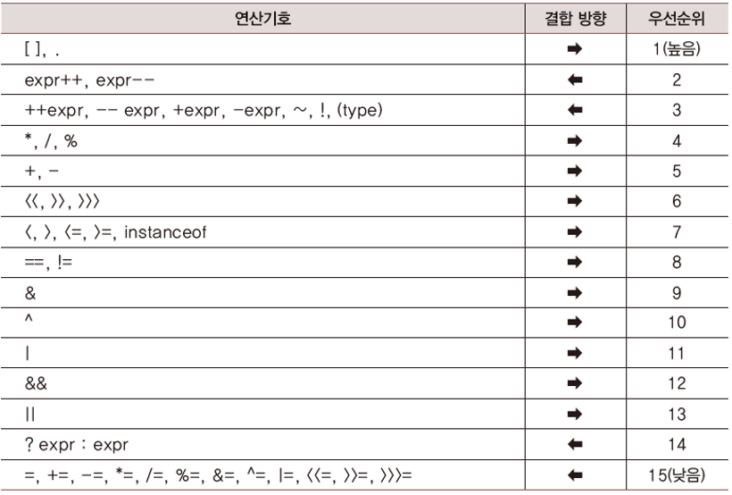

# Java Chapter 04

### 1. 자바에서 제공하는 이항 연산자들

- 우선순위 : 여러 개의 연산자가 존재할 때 우선순위
- 결합방향 : 우선순위가 다 같을 경우 어떠한 연산자를 먼저 할 것인지를 결정

- 대입 연산자와 산술 연산자

- 정수형 나눗셈과 실수형 나눗셈
  - 정수형은 나머지 버림
  - 실수형은 소수자리까지 나눔
- 복합 대입 연산자
  - 알아서 형변환을 해줍니다.
  - `num += 77L;` : num은 short형이지만 자동 형변환 
  - `num = (short)(num + 77L);` : 명시적 표기

- 관계 연산자
  - `true` 또는 `false` 반환
  - 형 변환이 필요할 경우 변환 후 비교

- 논리 연산자
  - 비교하는 피연산자가 `true` or `false`가 와야합니다.

### 2. 자바에서 제공되는 단항 연산자들

- 부호 연산자
  - `double e1 = 3.5;`
  - `double e2 = -e1`;  => e2에 저장되는 값은 -3.5
  - 즉 부호 연산자 `-`는 변수에 저장된 값으 부호를 바꾸어 반환
  - 또한 정수의 경우 int로 형 변환되기 때문에 조심!
- 증가 감수 연산자
  - 연산자가 뒤에 붙을 경우 해당 문장에서 먼저 활용하고 연산자 적용 => 다음 문장으로 넘어가야 반영

### 3. 비트를 대상으로 하는 연산자들

- 비트 활용은 **정수**만 가능!
- 각각의 비트를 대상으로 연산을 진행 => 그리고 각 비트를 대상으로 진행된 연산 결과를 반환

- 비트 쉬프트 연산자
  - 밀어버리고 남는 빈 공간을 0 or 1로 채움
  - n값 자체를 변경하는 것이 아님을 주의!
  - 규칙
    - 왼쪽 쉬프트 : 값 2배 증가
    - 오른쪽 쉬프트 : 값을 2로 나눈 결과

