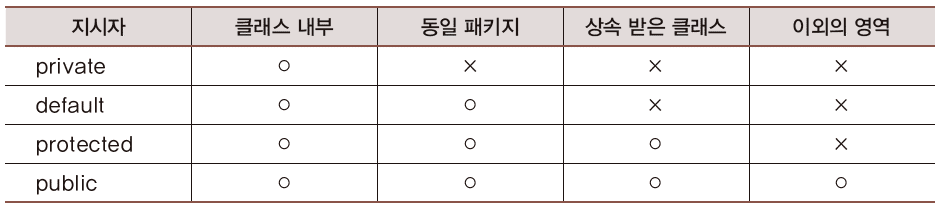

# Java Chapter 09

### 1. 정보 은닉 그리고 캡슐화

- 은닉 주체는 클래스
- 정보 은닉 : 클래스 내부에서만 데이터의 접근을 허용, 외부에서는 접근 불가 상태
  - 그런데 보통 인스턴스는 외부에서 사용하는데??
  - 그래서 데이터를 접근을 하지만 기능을 통해 접근하도록 하는 것
- 정보 은닉을 하는 이유
  - 방법 : 변수 앞에 `private` 넣어주기
    - 외부에서 인스턴스의 `.`을 통해 접근 불가

```java
class Circle {
   double rad = 0;      
   final double PI = 3.14;

   public Circle(double r) {
      setRad(r);
   }

   public void setRad(double r) {
      if(r < 0) { 
          rad = 0;
          return; 
      }
      rad = r;
   }

   public double getArea() {
      return (rad * rad) * PI;
   }
}

// 외부에서 인스턴스 활용!
Circle c = new Circle(1.5);
System.out.println(c.getArea());

c.setRad(2.5);
System.out.println(c.getArea());
c.setRad(-3.3);
System.out.println(c.getArea());
c.rad = -4.5;    // 컴파일 오류 발생 하지 않음 => 문제 발생 => 정보 은닉을 사용해서 직접 접근 막기
System.out.println(c.getArea());
```

- 정보은닉

```java
class Circle {
   // 외부에서 직접 접근시 컴파일 오류 발생
   private double rad = 0;
   final double PI = 3.14;

   public Circle(double r) {
      setRad(r);
   }
   public void setRad(double r) {  // Setter
      if(r < 0) { 
          rad = 0;
          return; 
      }
      rad = r;
   }
   public double getRad() {   // Getter
      return rad;
   }
   public double getArea() {...}
}
```


### 2. 접근 수준 지시자

- public > protected > default > private
- 클래스 정의 대상 : public, default
- 인스턴스 변수와 메소드 대상 : public , protected , default , private

- 클래스 정의 대상
  - public : 어디서든 인스턴스 생성 가능
    - 소스파일의 이름도 일치 시켜야 합니다 => 노출되어야 하기 때문에 생긴 규칙
    - 그래서 하나의 소스파일에는 하나의 public class 만 존재해야 합니다.
  - default : 동일 패키지로 묶인 클래스 내에서만 인스턴스를 허용
    - 생략하면 default
    - 소스파일이 나눠줘 있어도 선언된 패키지만 동일하면 하나의 패키지로 인식

```JAVA
// public
public class A{}

// default
class B{}
```

- 인스턴스 멤버 대상의 접근 수준 지시자
  - public : 외부에서 `.`찍고 접근 가능
  - private : 외부에서 `.`찍고 접근 불가능
  - default : 외부에서 동일 패키지에서 `.`찍고 접근 가능
  - protected : 상속 개념 적용 => 패키지가 다르지만 상속한 클래스의 변수나 메소드를 사용
    - 상속을 받으면 상속한 클래스의 변수나 메소드를 그대로 사용 가능

```java
class AAA {
   public int num1; 
   protected int num2;
   private int num3; 
   int num4;    // default 선언
   
   public void md1() {..}
   protected void md2() {..}
   private void md3() {..}
   void md4() {..}    // default 선언
}
```

- 디폴트 패키지 : 패키지 선언이 되어 있지 않은 클래스들을 하나의 패키지로 묶기 위한 개념
  - 만약 B 클래스가 A 클래스를 상속 했을 때 같은 패키지로 묶여있을 경우 변수나 메소드에 접근 가능
    - default 지시자이기 때문
  - 하지만 패키지가 다를 경우 컴파일러 에러 발생
    - 그래도 접근 하고 싶을 때 **protected** 사용

```java
package alpha;
public class AAA {
   protected int num;
}
```

```java
public class ZZZ extends alpha.AAA {
   public void init(int n) {
      num = n;    // 상속된 변수 num의 접근!
   }
}
```




### 3. 캡슐화

- 소프트웨어 공학적 측면이 강한 단어
- 하나의 클래스에 필요한 부분들을 적절하게 잘 담는 것
- 완벽한 캡슐화는 없지만 수준을 높여가는 것
- 캡슐화가 무너진 예
  - 코감기는 콧물, 재채기, 코 막힘을 늘 동반한다.
  - 약의 복용 순서가 중요하다면?

```java
// 클래스를 분리해서 작성
class SinivelCap {   // 콧물 처치용 캡슐
   void take() {
      System.out.println("콧물이 싹~ 납니다.");
   }
}

class SneezeCap {    // 재채기 처치용 캡슐
   void take() {
      System.out.println("재채기가 멎습니다.");
   }
}

class SnuffleCap {   // 코 막힘 처치용 캡슐
   void take() {
      System.out.println("코가 뻥 뚫립니다.");
   }
}

```

- 코감기 환자

```java
class ColdPatient {
   void takeSinivelCap(SinivelCap cap) {
      cap.take();
   }

   void takeSneezeCap(SneezeCap cap) {
      cap.take();
   }

   void takeSnuffleCap(SnuffleCap cap) {
      cap.take();
   }
}
```

- 메인 클래스
  - 복용해야 할 약의 종류가 어떤 클래스가 있는지 3가지 존재를 알야아 합니다.
  - 또 복용해야 할 약의 순서도 알아야 합니다.
  - 매우 복잡한 시스팀 설계 => 캡슐화를 잘 해놓으면 인스턴스 활용이 매우 쉽게 할 수 있습니다.

```java
class BadEncapsulation {
   public static void main(String[] args) {
      ColdPatient suf = new ColdPatient();
    
      // 콧물 캡슐 구매 후 복용
      suf.takeSinivelCap(new SinivelCap());

      // 재채기 캡슐 구매 후 복용
      suf.takeSneezeCap(new SneezeCap());

      // 코막힘 캡슐 구매 후 복용
      suf.takeSnuffleCap(new SnuffleCap());
   }
}
```

- 적절한 캡슐화의 예

```java
class SinusCap {

   void sniTake() {
      System.out.println("콧물이 싹~ 납니다.");
   }

   void sneTake() {
      System.out.println("재채기가 멎습니다.");
   }

   void snuTake() {
      System.out.println("코가 뻥 뚫립니다.");
   }

   void take() { // 약의 복용 방법 및 순서 담긴 메소드
      sniTake();
      sneTake();
      snuTake();
   }
}
```

- 인스턴스 사용해보기
  - 클래스를 하나만 알면 되고 복용 방법도 알 필요가 없습니다.

```java
class ColdPatient {
   void takeSinus(SinusCap cap) {
      cap.take();
   }
}

class OneClassEncapsulation {
   public static void main(String[] args) {
      ColdPatient suf = new ColdPatient();
      suf.takeSinus(new SinusCap());
   }
}
```

- 포함 관계로 캡슐화 완성하기
  - 포함 관계로 인스턴스를 생성해서 내부적으로 가짐으로써 캡슐화도 가능 => 이게 더 효율적일 수도 있다.
  - 클래스끼리 관계를 생성

```java
class SinusCap {
   SinivelCap siCap = new SinivelCap();
   SneezeCap szCap = new SneezeCap();
   SnuffleCap sfCap = new SnuffleCap();
   
   void take() {
      siCap.take(); szCap.take(); sfCap.take();
   }
}
```

