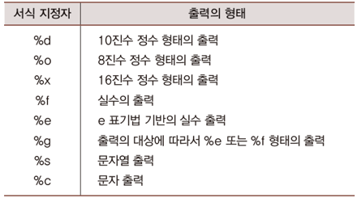

# Java Chapter 12

### 1. 콘솔 출력

- 콘솔 장치 : 키보드, 모니터, 마우스 등 기본 입출력 장치
- `System.out.println()` : 개행 포함
- `System.out.print()`
- `toString` 메소드
  - `println()`은 전달된 참조값의 `toString()`를 호출합니다.
  - 그럼 만약 `toString()` 메소드를 가지고 있지 않으면?
    - 모든 클래스는 `toString()` 메소드를 가지고 있습니다. ( 기본적으로 존재 )

```java
class Box {
   private String conts;
   
   Box(String cont) {
      this.conts = cont;
   }
   public String toString() {
      return conts; // 문자열 반환
   }
}

public static void main(String[] args) {
   StringBuilder stb = new StringBuilder("12");
   stb.append(34);
   System.out.println(stb.toString()); // 1234
   System.out.println(stb); // 1234

   Box box = new Box("Camera");
   System.out.println(box.toString()); // Camera
   System.out.println(box); // Camera
}
```

- 문자열의 조합 `printf` 메소드
  - f => 포맷의 약자
  - 첫번째 인자 : 문자열
  - 두번째 인자 : 값
  - 쌍으로 연결 가능

```java
System.out.printf("정수는 %d, 실수는 %f, 문자는 %c", 12, 24.5, 'A');
// 정수는 12, 실수는 24.5, 문자는 A
```




### 2. 콘솔 입력

- Scanner 클래스
  - 특정 인스턴스, 키보드, 파일 등을 입력받을 수 있습니다.

```java
public static void main(String[] args) {
   String source = "1 3 5";
   Scanner sc = new Scanner(source);     // Scanner 인스턴스 생성
   int num1 = sc.nextInt();    // int형 데이터 추출
   int num2 = sc.nextInt();    // int형 데이터 추출
   int num3 = sc.nextInt();    // int형 데이터 추출

   int sum = num1 + num2 + num3; // 9
   System.out.printf("%d + %d + %d = %d \n", num1, num2, num3, sum);
}
```

- 키보드 적용

```java
// 입력
12
24
36
//    
public static void main(String[] args) {
   // 키보드와 연결 
   Scanner sc = new Scanner(System.in);
   int num1 = sc.nextInt();
   int num2 = sc.nextInt();
   int num3 = sc.nextInt();

   int sum = num1 + num2 + num3; // 72
   System.out.printf("%d + %d + %d = %d \n", num1, num2, num3, sum);
}
```

- Scanner 클래스의 주요 메소드

```java
int nextInt()
byte nextByte()
String nextLine()
double nextDouble()
boolean nextBoolean()
```

```java
public static void main(String[] args) {
   Scanner sc = new Scanner(System.in);

   System.out.print("문자열 입력: ");
   String str1 = sc.nextLine();

   System.out.print("문자열 입력: ");
   String str2 = sc.nextLine();

   System.out.printf("입력된 문자열 1: %s \n", str1);
   System.out.printf("입력된 문자열 2: %s \n", str2);
}
```

