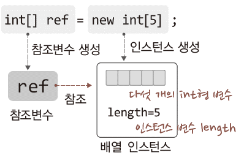
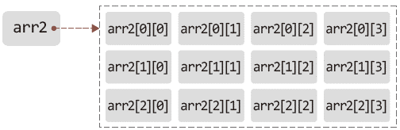
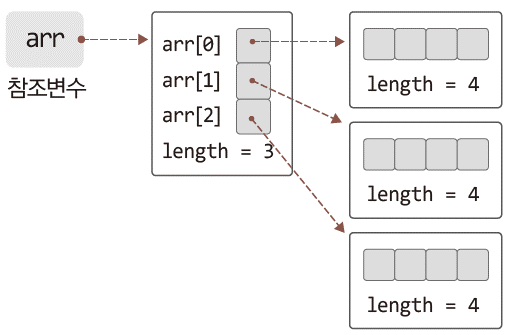

# Java Chapter 13

### 1. 1차원 배열의 이해와 활용

- 1차원 배열 : 타입이 같은 둘 이상의 데이터를 저장할 수 있는 1차원 구조의 메모리 공간
- 선언 방법
  - 배열도 인스턴스

```java
int[] ref = new int[5];     // 길이가 5인 int형 1차원 배열의 생성문
```



- 예시

```java
public static void main(String[] args) {
   // 길이가 5인 int형 1차원 배열의 생성
   int[] ar1 = new int[5];

   // 길이가 7인 double형 1차원 배열의 생성
   double[] ar2 = new double[7];

   // 배열의 참조변수와 인스턴스 생성 분리
   float[] ar3;
   ar3 = new float[9];

   // 배열의 인스턴스 변수 접근
   System.out.println("배열 ar1 길이: " + ar1.length); // 5
   System.out.println("배열 ar2 길이: " + ar2.length); // 7
   System.out.println("배열 ar3 길이: " + ar3.length); // 9
}
```

- 배열의 활용 ( 값의 저장 )
  - index값은 0부터 시작

```java
int[] ar = new int[3];

ar[0] = 7;       // 값의 저장: 첫 번째 요소
ar[1] = 8;       // 값의 저장: 두 번째 요소
ar[2] = 9;       // 값의 저장: 세 번째 요소

int num = ar[0] + ar[1] + ar[2];     // 값의 참조
```

- 배열의 장점
  - 반복문을 통해 순차적 접근이 가능

```java
int cnum = 0; 
for(int i = 0; i < sr.length; i++)
	cnum += sr[i].length();

System.out.println("총 문자의 수: " + cnum);
```

- 배열을 생성과 동시에 초기화

```java
int[] arr = new int[3];
// 배열의 길이를 생략 => 컴파일러가 알아서 넣어줌!
int[] arr = new int[] {1, 2, 3};
int[] arr = {1, 2, 3};
```

- 배열 대상 참조변수 선언의 두 가지 방법

```java
int[] ar = new int[3];      // 조금 더 선호하는 방법
int ar[] = new int[3];
```

- 배열의 참조 값과 메소드
  - 배열은 인자로 전달할 수 있고 반환도 가능합니다.

```java
public static void main(String[] args) {
   int[] ar = {1, 2, 3, 4, 5, 6, 7};
   int sum = sumOfAry(ar);    // 배열의 참조 값 전달
   ....
}
```

- 배열의 디폴트 초기화
  - 기본 자료형 배열은 모든 요소 0으로 초기화
  - 인스턴스 배열(참조변수 배열)은 모두 `null`로 초기화
    - `String[] ar = new String[10];`
- 배열의 초기화 메소드
  - java.util.Arrays 클래스에 정의
  - `fill()` : 원하는 값을 모두 채우거나 일부를 채울 때 사용

```java
// 오버로딩이 잘 되어 있어서 다양한 자료형 받을 수 있음

public static void fill(int[] a, int val)
// 두 번째 인자로 전달된 값으로 배열 초기화

public static void fill(int[] a, int fromIndex, int toIndex, int val)
// 덱스 fromIndex ~ (toIndex-1)의 범위까지 val의 값으로 배열 초기화
```

- 배열 복사 메소드
  - java.lang.System 클래스에 정의
  - `arraycopy()` : 한 배열에 저장된 값을 다른 배열에 복사

```java
public static void 
     arraycopy(Object src, int srcPos, Object dest, int destPos, int length)
          // 복사 원본의 위치: 배열 src의 인덱스 srcPos
          // 복사 대상의 위치: 배열 dest의 인덱스 destPos
          // 복사할 요소의 수: length
```

- 예시

```java
import java.util.Arrays;

class ArrayUtils {
   public static void main(String[] args) {
      int[] ar1 = new int[10];
      int[] ar2 = new int[10];
   
      Arrays.fill(ar1, 7);    // 배열 ar1을 7로 초기화
      System.arraycopy(ar1, 0, ar2, 3, 4);    // 배열 ar1을 ar2로 부분 복사
   
      for(int i = 0; i < ar1.length; i++)
         System.out.print(ar1[i] + " "); // 7777777777
      System.out.println(); // 단순 줄 바꿈
   
      for(int i = 0; i < ar2.length; i++) 
         System.out.print(ar2[i] + " "); // 0007777000
   }
}
```

- main 메소드의 매개변수 선언
  - 자동으로 JVM이 `String[] arr`의 길이갸 0인 배열을 만든 후 main 메소드를 실행

```java
// String[] arr = new String[] {}; => JVM이 Main 메소드에 전달 및 실행
public static void main(String[] args) {....}

// java Simple Coffe Milk Orange => 이렇게 실행 => 배열에 Coffe Milk Orange 값을 넣어서 전달
String[] arr = new String[]{"Coffe", "Milk", "Orange"};
main(arr);
```


### 2. enhanced for 문 ( for-each 문 )

- 배열 요소의 순차적 접근
  - 장점 : **코드의 양이 줄고 배열의 길이와 요소에 신경 쓸 필요 없습니다.**

```java
int[] ar = {1, 2, 3, 4, 5};
for(int i = 0; i < ar.length; i++) {
   System.out.println(ar[i]);
}

int[] ar = {1, 2, 3, 4, 5};
for(int e : ar) {
   System.out.println(e);
}
```


### 3. 다차원 배열의 이해와 활용

- 다차원 배열 : 2차원 배열과 3차원 배열을 의미

- 2차원 배열의 생성
  - `int[][] arr2 = new int[3][4]`



- 2차원 배열의 실제 구조
  - `int[][] = new int[3][4]`
  - 다수의 1차원 배열을 생성 후 엮어서 구성



- 2차원 배열의 초기화

```java
int[][] arr = {
   {11, 22, 33},
   {44, 55, 66}, 
   {77, 88, 99}
};

int[][] arr = {
   {11},
   {22, 33},
   {44, 55, 66}
};
```

