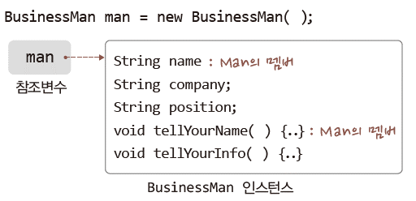

# Java Chapter 14

### 1. 상속의 기본 문법 이해

- 상속의 치명적인 오해
  - 코드의 재활용을 위한 문법?
- 정답
  - 연관된 일련의 클래스들에 대해 공통적인 규약을 정의할 수 있습니다.

- 상속의 가장 기본적인 특성

```java
class Man {
   String name;
   public void tellYourName() {
      System.out.println("My name is " + name);
   }
}

// Man 클래스를 상속 ( extends 키워드 사용 )
class BusinessMan extends Man {
   String company;
   String position;
   public void tellYourInfo() {
      System.out.println("My company is " + company);
      System.out.println("My position is " + position);
      tellYourName();
   }
}
```

- 상속받은 Man 클래스의 프로퍼티와 메소드까지 참조할 수 있게 됩니다.
- 같은 영역에 존재하더라도 상속받은 클래스의 접근자가 **private면 존재는 하지만 접근은 불가능!**



- 상속 관련 용어의 정리와 상속의 UML 표현
  - BusinessMan → Man
  - 상속의 대상이 되는 클래스 : 상위 클래스, 기초 클래스, 부모 클래스
  - 상속을 하는 클래스 : 하위 클래스, 유도 클래스, 자식 클래스

- 상속과 생성자 ( 1 )

```java
class Man {
   String name;

   public Man(String name) {
      this.name = name;
   }

   public void tellYourName() {
      System.out.println("My name is " + name);
   }
}

// 문제점 : BusinessMan 생성시 그 안에 존재하는 상속받은 Man의 name은 초기화가 되지 않음
class BusinessMan extends Man {
   String company;
   String position;

   public BusinessMan(String company, String position) {
      this.company = company;
      this.position = position;
   }

   public void tellYourInfo() {
      System.out.println("My company is " + company);
      System.out.println("My position is " + position);
      tellYourName();
   }
}
```

- 상속과 생성자 ( 2 )
  - 하지만 이 부분도 이상함 => 보통 클래스의 변수들은 자기 생성자에서 초기화 하는 것이 가장 이상적
    - 지금은 `BusinessMan` 클래스에서 초기화 => 생성자를 통한 초기화 원칙에 어긋남!

```java
class BusinessMan extends Man {
   String company;
   String position;

   public BusinessMan(String name, String company, String position) {
      // 상위 클래스 Man의 멤버 초기화
      this.name = name;
      
      // 클래스 BusinessMan의 멤버 초기화
      this.company = company;
      this.position = position;
   }
   
   public void tellYourInfo() { . . . }
}
```

- 상속과 생성자 ( 3 ) : 생성자 호출 관계 파악하기
  - 호출할 상위 클래스의 생성자를 명시하지 않으면 void 생성자가 호출!
  - 즉 반드시 하위 클래스 호출시에 상위 클래스의 생성자를 호출해야 합니다.
    - 그래서 즉 하위 클래스의 생성자 안에 상위 클래스의 생성자를 호출하는 문장이 존재해야 함!
    - 없으면 컴파일러가 자동으로 넣어줍니다!

```java
// 상위 클래스
class SuperCLS {
   public SuperCLS() {
      System.out.println("I'm Super Class");
   }
}

// 자식 클래스
class SubCLS extends SuperCLS {
   public SubCLS() {
      System.out.println("I'm Sub Class");
   }
}

class SuperSubCon {
   public static void main(String[] args) {
      // 상위 클래스의 생성자가 먼저 실행 => 하위 클래스 생성자 실행
      new SubCLS();
      // I'm Super Class
      // I'm Sub Class
   }
}
```

- 상속과 생성자 ( 4 )
  - `super()` : 상위 클래스의 생성자 호출을 명시할 수 있습니다.

```java
class SuperCLS {
   public SuperCLS() {
      System.out.println("...");
   }

   public SuperCLS(int i) {
      System.out.println("...");
   }

   public SuperCLS(int i, int j) {
      System.out.println("...");
   }
}

class SubCLS extends SuperCLS {
   public SubCLS() {
      System.out.println("...");
   }

   public SubCLS(int i) {
      super(i); 
      System.out.println("...");
   }
	
   // 오버로딩 
   public SubCLS(int i, int j) {
      super(i, j); 
      System.out.println("...");
   }
}
```

- 적절한 생성자 정의의 예

```java
class Man {
   String name;
   
   public Man(String name) {
      this.name = name;
   }
   public void tellYourName() {
      System.out.println("My name is " + name);
   }
}

class BusinessMan extends Man {
   String company;
   String position;

   public BusinessMan(String name, String company, String position) {
      super(name); 
      this.company = company;
      this.position = position;
   }
   public void tellYourInfo() {
      System.out.println("My company is " + company);
      System.out.println("My position is " + position);
      tellYourName();
   }
}
```

- 단일 상속만 지원하는 자바
  - 자바는 다중 상속을 지원하지 않습니다.
  - **한 클래스에서 상속할 수 있는 최대 클래스는 한 개 입니다.**


### 2. 클래스 변수, 클래스 메소드와 상속

- `static`은 부모 것이 아님으로 상속이 불가

```java
class SuperCLS {
   static int count = 0;   // 클래스 변수
   
   public SuperCLS() {
      count++;   // 클래스 내에서는 직접 접근이 가능
   }
}

class SubCLS extends SuperCLS {
   public void showCount() {
      // private가 아니면 자식도 부모가 가지는 접근 권한만 가지게 됩니다!
      System.out.println(count);   // 상위 클래스에 위치하는 클래스 변수에 접근
   }
}
```

